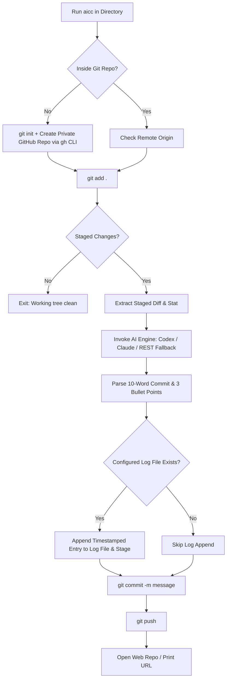

<div align="center">
  <h1>⚡ aicc</h1>
  <p><strong>Reproducible AI-driven git staging, 10-word commit generation, and automated changelog maintenance for Codex, Claude Code, and direct APIs.</strong></p>

  [](https://learn.microsoft.com/en-us/powershell/)
  [](https://microsoft.com/windows)
  [](LICENSE)
  [](https://cli.github.com/)
  [](https://openai.com/)
  [](https://anthropic.com/)
</div>

---

## ⚡ Quickstart — Setup in 30 Seconds

```bash
# 1. Clone the repository
git clone https://github.com/IamOumarIbrahim/aicc.git
cd aicc

# 2. Run the interactive setup wizard
.\setup.bat
```

Once installed, simply run `aicc` from inside any project directory:

```bash
# In any directory or workspace:
aicc
```

---

## 🎯 What `aicc` Does



1. **Auto-Detects or Creates Git Repository**: If you run `aicc` inside an unversioned directory, it automatically initializes Git and creates a private GitHub repository via GitHub CLI (`gh`), setting up the remote origin instantly.
2. **Stages All Changes**: Runs `git add .` safely.
3. **Generates 10-Word AI Commit Messages**: Dispatches staged diffs and statistics to your chosen AI engine (**OpenAI Codex**, **Anthropic Claude Code**, or direct REST APIs).
4. **Maintains Your Custom Log File**: Appends timestamped headers and concise change summaries to your configured logging markdown file (`CHANGELOG.md`, `dev.md`, `logging.md`, `devlog.md`, etc.).
5. **Commits and Pushes**: Commits the clean message, tracks upstream branches, pushes to remote, and optionally opens your GitHub repository in browser.

---

## 🛡️ Built-in Self-Healing Architecture

`aicc` is engineered with an 8-layer self-healing subsystem to guarantee zero runtime failures across diverse environments:

1. **20+ Log Naming Candidate Auto-Discovery**: If no log file is explicitly configured (or if the configured name is absent), `aicc` automatically searches the repository root for over 20 standard naming conventions (`CHANGELOG.md`, `dev.md`, `logging.md`, `devlog.md`, `changes.md`, `history.md`, `releases.md`, `worklog.md`, etc.) and fuzzy matches any root log markdown file.
2. **Git Executable Auto-Discovery**: If `git` is missing from the active subshell PATH, `aicc` checks standard Windows install directories (`Program Files`, `AppData/Local/Programs/Git`, Chocolatey) and auto-injects it into the session.
3. **User Identity Self-Healing**: Automatically prevents `unable to auto-detect email address` Git errors by resolving missing `user.name` and `user.email` from GitHub CLI profile or system login identity.
4. **Multi-Tier AI Cascaded Fallbacks**: If the local CLI (`codex` or `claude`) times out or encounters PATH errors, `aicc` seamlessly falls back to direct REST API calls (`gpt-4o-mini`, `claude-3-5-haiku`).
5. **Cross-Provider Key Recovery**: If the selected provider has no valid key configured, `aicc` checks for alternative provider keys present in `~/.aicc/.env`.
6. **Deterministic Offline Fallback**: If internet connectivity is down or all AI keys fail, `aicc` parses staged diff statistics to generate a meaningful conventional commit message and changelog entry, ensuring commits are never blocked.
7. **Remote Push & Divergence Resolution**: Automatically sets upstream tracking (`git push -u origin <branch>`) on new repos, and detects non-fast-forward remote divergences to execute an automated `git pull --rebase` before pushing.
8. **Universal Web URL Parsing**: Normalizes SSH (`git@github.com:...`) and HTTPS Git remotes to open the repository in the user's default browser even without GitHub CLI installed.


---

## ⚙️ Configuration & Customization

The interactive setup wizard saves your settings securely outside repository tracking at `~/.aicc/`:

- **Configuration File**: `%USERPROFILE%\.aicc\config.json`
- **Secrets File**: `%USERPROFILE%\.aicc\.env`

### `config.json` Options

```json
{
  "cli_provider": "codex",
  "log_filename": "CHANGELOG.md",
  "auto_create_private_repo": true,
  "default_branch": "main",
  "max_commit_words": 10,
  "changelog_bullets_count": 3,
  "open_web_on_push": true,
  "openai_model": "gpt-4o-mini",
  "anthropic_model": "claude-3-5-haiku-20241022"
}
```

| Key | Type | Default | Description |
| :--- | :--- | :--- | :--- |
| `cli_provider` | `string` | `"codex"` | AI CLI engine: `"codex"`, `"claude"`, `"openai"`, or `"anthropic"`. |
| `log_filename` | `string` | `"CHANGELOG.md"` | The markdown file to maintain (e.g. `CHANGELOG.md`, `dev.md`, `logging.md`). |
| `auto_create_private_repo` | `boolean` | `true` | Automatically initializes git & creates private GitHub repository if called in unversioned folder. |
| `default_branch` | `string` | `"main"` | Default branch name for newly initialized repositories. |
| `max_commit_words` | `integer` | `10` | Maximum words allowed for the AI commit message. |
| `changelog_bullets_count` | `integer` | `3` | Number of change summary bullets appended per commit. |
| `open_web_on_push` | `boolean` | `true` | Automatically opens the GitHub repository in your default browser upon push. |

---

## 🔐 Security & Zero Key Leakage

- **API Keys are Never Committed**: `.env` and `config.json` files are explicitly excluded via `.gitignore`.
- Keys are kept in the user's secure home profile directory (`%USERPROFILE%\.aicc\.env`).
- Environment variables are isolated to the running subshell process.

---

## 🛠️ CLI Providers Supported

| Engine | Execution Method | Fallback Strategy |
| :--- | :--- | :--- |
| **OpenAI Codex** | `@openai/codex` / `codex.cmd` | Zero-dependency OpenAI REST API (`gpt-4o-mini`) via `Invoke-RestMethod` |
| **Anthropic Claude** | `claude` / `@anthropic-ai/claude-code` | Zero-dependency Anthropic Messages API (`claude-3-5-haiku`) |
| **Direct API Mode** | Native PowerShell HTTP Requests | Direct endpoint calls with no npm dependencies required |

---

## 📁 Repository Structure

```
aicc/
├── .gitignore              # Strict exclusions (.env, config.json, temp files)
├── .env.example            # Environment template for manual configurations
├── config.example.json     # Configuration template with schema references
├── LICENSE                 # MIT License
├── README.md               # Documentation & usage guide
├── setup.bat               # Interactive setup batch launcher
├── setup.ps1               # Automated configuration & PATH installer
├── aicc.cmd                # Global CMD execution entrypoint
└── aicc.ps1                # Core automation engine
```

---

## 📜 License

Distributed under the [MIT License](LICENSE). Copyright (c) 2026 [Oumar Ibrahim (IamOumarIbrahim)](https://github.com/IamOumarIbrahim).
